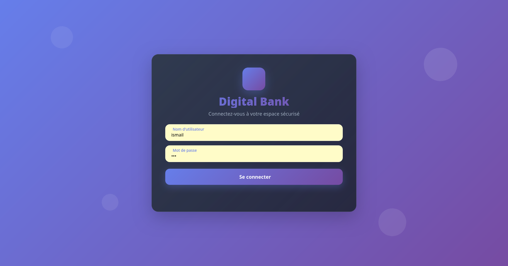

# Digital Banking Web Application

## Overview

The **Digital Banking Web Application** is a modern web-based platform designed to manage banking operations efficiently. It allows users to perform various banking tasks such as managing accounts, viewing transactions, and transferring funds. The application is built with a focus on scalability, security, and user experience.

## Features

- **User Authentication**: Secure login and registration system.
- **Account Management**: Create, view, and manage multiple bank accounts.
- **Transaction History**: View detailed transaction records.
- **Fund Transfers**: Transfer money between accounts.
- **Admin Dashboard**: Manage users and accounts with administrative privileges.
- **Responsive Design**: Optimized for both desktop and mobile devices.

## Technologies Used

- **Frontend**: React, HTML, CSS, JavaScript
- **Backend**: Spring Boot, Java
- **Database**: MySQL
- **API**: RESTful APIs for communication between frontend and backend
- **Build Tools**: Maven
- **Version Control**: Git

## Prerequisites

Before setting up the project, ensure you have the following installed:

- Java 17 or higher
- Node.js and npm
- MySQL Server
- Maven
- Git

## Setup Instructions

1. **Clone the Repository**:
   ```bash
   git clone https://github.com/your-repo/digital-banking-web.git
   cd digital-banking-web
   ```

2. **Backend Setup**:
   - Navigate to the backend directory:
     ```bash
     cd backend
     ```
   - Configure the database connection in `application.properties`:
     ```properties
     spring.datasource.url=jdbc:mysql://localhost:3306/digital_banking
     spring.datasource.username=your_username
     spring.datasource.password=your_password
     ```
   - Build and run the backend:
     ```bash
     mvn clean install
     mvn spring-boot:run
     ```

3. **Frontend Setup**:
   - Navigate to the frontend directory:
     ```bash
     cd frontend
     ```
   - Install dependencies:
     ```bash
     npm install
     ```
   - Start the development server:
     ```bash
     npm start
     ```

4. **Access the Application**:
   - Open your browser and navigate to `http://localhost:3000` for the frontend.
   - The backend API will be available at `http://localhost:8080`.

## Usage

- **User Login**: Use your credentials to log in or register a new account.
- **Account Management**: Navigate to the accounts section to view or create accounts.
- **Transactions**: View transaction history or initiate fund transfers.
- **Admin Features**: Access the admin dashboard for user and account management.

## Screenshots

Here are some screenshots of the application:

### Login Page


### Dashboard


### Customers Management


### Accounts Management


### Unauthorized Access Page


`
