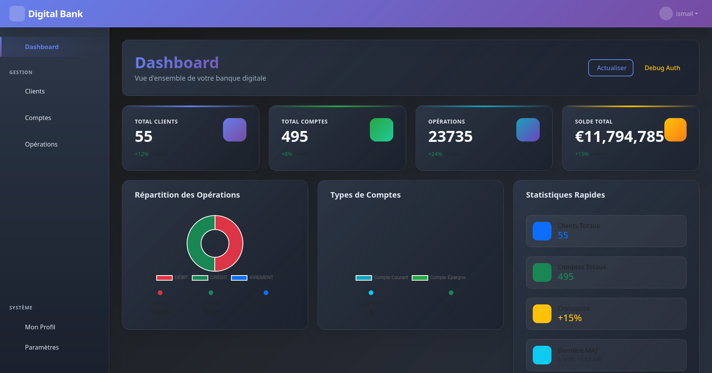
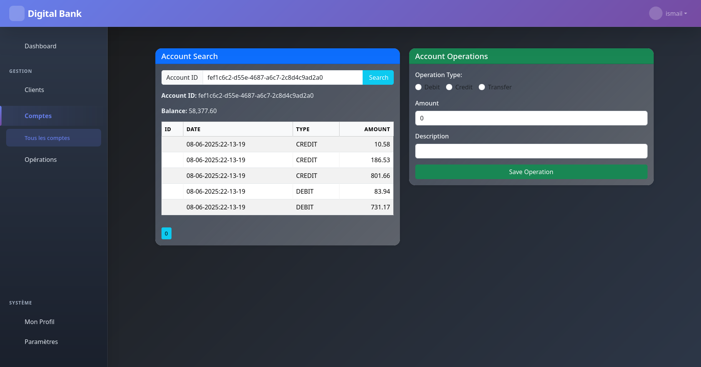

# Digital Banking Web Application


[](https://github.com/Ismail-Drissi-ENSET-TPs/Digital-Banking-App)

## Overview

The **Digital Banking Web Application** is a web-based platform designed to manage banking operations. It allows users to perform various banking tasks such as managing accounts, viewing transactions, and transferring funds.

## Features

- **User Authentication**: Secure login system.
- **Account Management**: Create, view, and manage multiple bank accounts.
- **Transaction History**: View detailed transaction records.
- **Fund Transfers**: Transfer money between accounts.
- **Admin Dashboard**: Manage users and accounts with administrative privileges.
- **Responsive Design**: Optimized for both desktop and mobile devices.

## Technologies Used

- **Frontend**: Angular
- **Backend**: Spring Boot, Java
- **Database**: MySQL

## Setup Instructions

1. **Clone the Repository**:
   ```bash
   git clone https://github.com/Ismail-Drissi-ENSET-TPs/Digital-Banking-App-Web.git
   cd digital-banking-web
   ```

3. **Frontend Setup**:
   - Navigate to the frontend directory:
     ```bash
     cd frontend
     ```
   - Install dependencies:
     ```bash
     npm install
     ```
   - Start the development server:
     ```bash
     npm start
     ```

4. **Access the Application**:
   - Open your browser and navigate to `http://localhost:4200` for the frontend.

## Usage

- **User Login**: Use your credentials to log in or register a new account.
- **Account Management**: Navigate to the accounts section to view or create accounts.
- **Transactions**: View transaction history or initiate fund transfers.
- **Admin Features**: Access the admin dashboard for user and account management.

## Screenshots

Here are some screenshots of the application:

### Login Page


### Dashboard


### Customers Management


### Accounts Management


### Unauthorized Access Page


`
